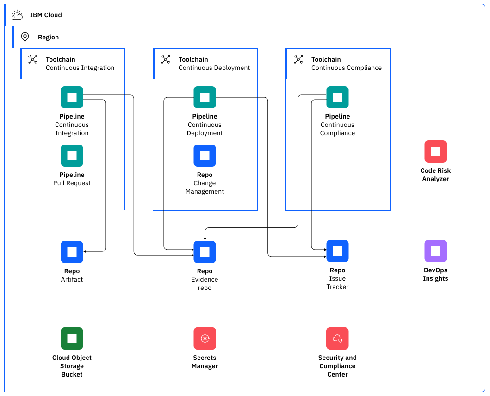
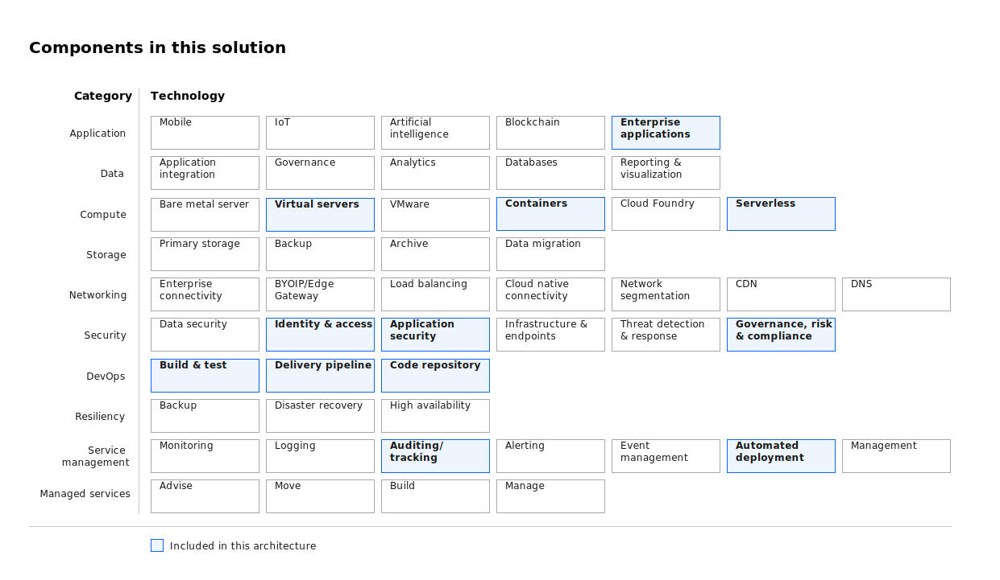

---
copyright:
  years: 2023
lastupdated: "2023-03-31"

keywords:

subcollection: deployable-reference-architectures

authors:
  - name: Padraic Edwards
  - name: Hua Yuen Hui

version: 1.0

deployment-url: https://cloud.ibm.com/catalog/architecture/deploy-arch-ibm-devsecops-alm-e1c16cac-7ea8-413f-a819-67e3a3251e44-global

docs: https://cloud.ibm.com/docs/devsecops-alm

image_source: https://github.com/terraform-ibm-modules/terraform-ibm-devsecops-alm/reference-architectures/diagram-deploy-arch-ibm-devsecops-alm-diagram.svg

related_links:
  - title: 'DevSecOps for IBM Cloud'
    url: 'https://cloud.ibm.com/docs/devsecops?topic=devsecops-cd-devsecops-arch'
    description: 'The DevSecOps reference architecture streamlines compliance and audit-readiness by using building blocks like Tekton task library and toolchain templates.'

use-case: DevOps

industry: Technology

content-type: reference-architecture

---

{{site.data.keyword.attribute-definition-list}}

# DevSecOps application lifecycle management
{: #deploy-arch-ibm-devsecops-alm}
{: toc-content-type="reference-architecture"}
{: toc-industry="Technology"}
{: toc-use-case="DevOps"}

The DevSecOps deployable architecture creates a set of DevOps Toolchains and pipelines. DevSecOps uses Continuous Delivery (Git Repos and Issue Tracking, Tekton Pipelines, DevOps Insights, and Code Risk Analyzer), Secrets Manager, Key Protect, Cloud Object Storage, Container Registry and Vulnerability Advisor. 
{: shortdesc}

Out of the box, DevSecOps also leverages popular scanning tools such as SonarQube, GoSec, OWASP Zap (dynamic scan), any unit test framework, and GPG signing. It can also be used with more tools such as external Git providers and artifact stores. DevSecOps supports hybrid deployments, in particular by using private pipeline workers, and can be interfaced with other deployment tools such as Satellite Config.

## Architecture diagram
{: #architecture-diagram}

{: caption="Figure 1. Architecture diagram for a set of DevSecOps CI/CD/CC toolchains using the Continuous Delivery service on IBM Cloud" caption-side="bottom"}

## Design requirements
{: #design-requirements}

{: caption="Figure 2. Scope of the design requirements" caption-side="bottom"}

## Components
{: #components}

The following components are included that support the requirements. Alternatives are included where they are available and work with this architecture.

| Requirement | Component | Reasons for choice | Alternative choice |
|-------------|-----------|--------------------|--------------------|
|     Continuous Integration Toolchain        |    Toolchain Service       |        The continuous integration toolchain and pipelines tests, scans and builds the deployable artifacts from the application repositories.             |                    |
|     Continuous Deployment Toolchain         |    Toolchain Service       |        The continuous deployment toolchain and pipeline generates all of the evidence and change request summary content. The pipeline deploys the build artifacts to an environment, such as staging or production, and then collects, creates, and uploads all existing log files, evidence, and artifacts to the evidence locker.           |                    |
|     Continuous Compliance Toolchain         |    Toolchain Service       |        The continuous compliance toolchain and pipeline periodically scans the deployed artifacts and their source repositories.            |                    |
{: caption="Table 1. Components" caption-side="bottom"}

## Next steps
{: #next-steps}

Install the DevSecOps application lifecycle management deployable architecture on this infrastructure.
